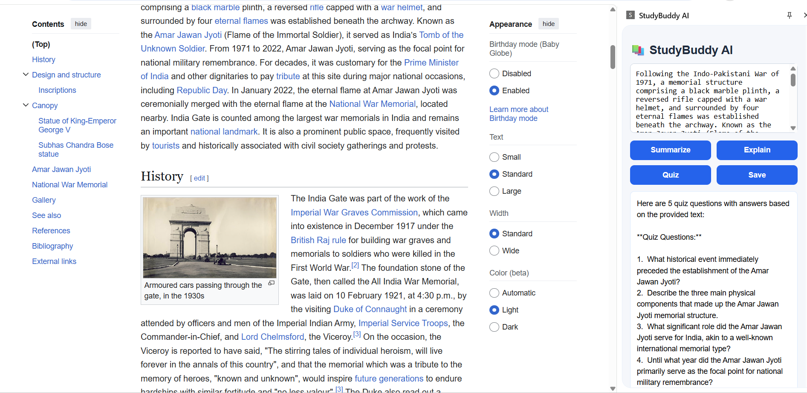

## StudyBuddy AI Frontend

StudyBuddy AI Frontend is a Chrome extension built using HTML, CSS, and JavaScript. It helps students interact with selected text from webpages and get AI-powered study support such as summarization, explanation, and quiz generation.

## Project Overview

The frontend of StudyBuddy AI runs as a Chrome extension. It captures selected text from webpages, displays it in a side panel, and sends it to the backend for AI processing. The processed response is then shown inside the extension interface.

## Features

- Capture selected text from webpages
- Display selected text in the extension side panel
- Summarize text using AI
- Explain concepts in simple words
- Generate quiz questions from selected content
- Save notes locally using Chrome storage
- View and clear saved notes history

## Technologies Used

- HTML
- CSS
- JavaScript
- Chrome Extension APIs
- Chrome Storage API

## Folder Structure

```text
StudyBuddy-AI/
├── manifest.json
├── popup.html
├── popup.js
├── sidepanel.html
├── sidepanel.js
├── sidepanel.css
├── content.js
├── service-worker.js
└── assets/
    └── study.png
```

## Screenshot
StudyBuddy AI Extension


## How It Works
The user selects text from any webpage.
The content script captures the selected text.
The selected text is stored using Chrome storage.
The side panel displays the text.
On clicking Summarize, Explain, or Quiz, the frontend sends the text to the backend API.
The backend processes the request using AI and returns the result.
The result is shown in the extension output area.

## Installation Steps
Download or clone this repository.
Open Google Chrome.
Go to chrome://extensions/.
Enable Developer Mode.
Click Load unpacked.
Select the frontend project folder.
The StudyBuddy AI extension will now appear in Chrome.

## Usage
Open any webpage.
Select a paragraph or text.
Open the StudyBuddy AI extension.
The selected text will appear in the side panel.
Click any feature button such as Summarize, Explain, or Quiz.
View the AI-generated response.
Save the result if needed.

## Backend Connection

The frontend connects to the deployed backend API for AI features. Make sure the backend is running and the API URL in sidepanel.js is correct.

## Future Enhancements

Dark mode
Flashcard generation
Study planner
Voice-based reading support
User authentication

## Author

Devanjana A
